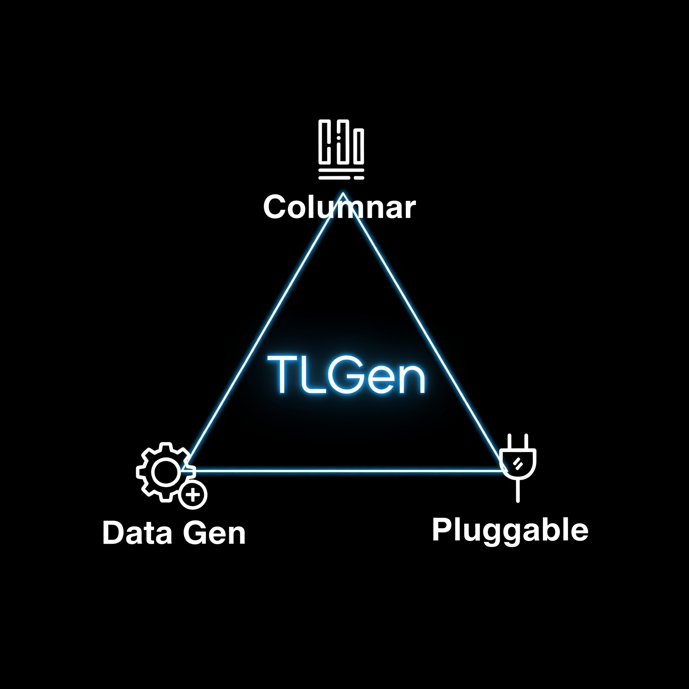

# trans-log-generator
A crude framework for trans log like data generation and post processing. Uses legacy multi-process tech for parrelism, but extreamely fast at data generation due to columnar processing.

Below is a video of it in action using default configuration (unit test configuration):

# Columnar data generation
Translog generator uses the PPSS (Parallel Processing Shell Script) https://github.com/louwrentius/PPSS to parallelise the data generation process by column (field) of the data to be generated. This provides following advantages:
- simple to debug scripts
- Efficient data generation for same type of data
- ability to maintain statistical distributions easily
- Use any language or tool (this project previously used perl and bash for certain data generation, and may use rust in the future). Use whatever less complex, maintainable and most importantly: which gives the best performance.

# How it works
1. start-loggen.sh does the validations and prepares the pararelizations. 
2. translog_gen.sh is the handler script for each pararellel process launched and it does process wise modifications before launching the required script which does the actual data generation. The required script is selected depending on field_format or distribution configuration.
3. The script has only one job: it needs to generate data in proper order and in proper record count and write to temp folder as field_name.csv
4. PPSS detects when all column data is finished generating in the 1st phase. 2nd phase of job is again carried out to generate any data which has references (dependencies) to first set of data.
5. All temp generated data files is checked for record counts (nothing else) before they are merged to create a single or multiple trans log (or csv). User can see graphs of timing data or statistical data if required.
6. Postprocessing steps execute additional format changes as required.

# Supported distributions of data

| Distribution(s) | Description | Used libraries |
|---|---|---|
| Numeric | Various statistical distributions like normal, random | numpy random |
| Pre-configured enumerations | random, percentage wise and round robin | numpy random |
| Dynamic enumurations | similar to pre-configured. Fake and regular expression matching data generation is done on the fly | Faker and xeger |
| Dependent enumuration (aka refer) | for field values depending on other field | python random |
| Equation|f(x) of statistical distribution|sympy|

# Setup
Please see README-setup.md on how to setup dependencies, configure a translog field format file and generate data.

[How to setup](README-setup.md)

# Other fatures
- Post parsing like converting to excel, json or xml or sending data to a http rest endpoint
